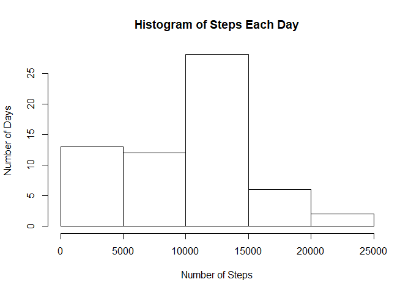
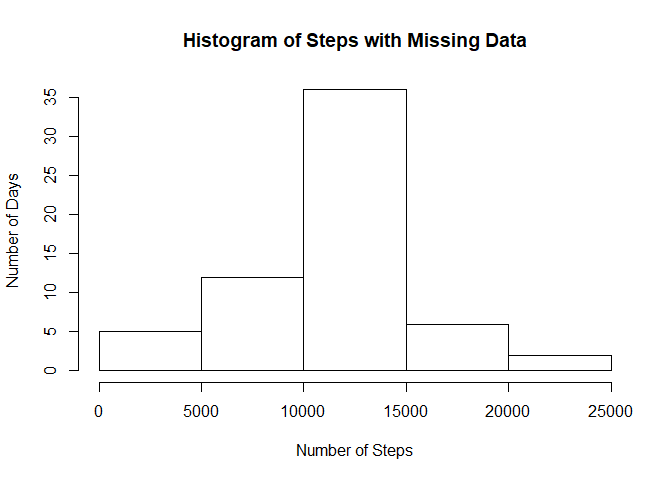

R Markdown
----------

First, download the data and read it into r

    download.file(url = "https://d396qusza40orc.cloudfront.net/repdata%2Fdata%2Factivity.zip", destfile = "./data.zip")
    unzip(zipfile = "./data.zip")
    activity <- read.csv(file = "activity.csv")

Number of Steps each day
------------------------

Histogram:

    stepsPerDay <- xtabs(activity$steps~activity$date)
    stepsPerDayData <- data.frame(stepsPerDay)
    hist(stepsPerDayData$Freq, xlab = "Number of Steps", ylab = "Number of Days", main = "Histogram of Steps Each Day")

Summary Statistics:

    summary(stepsPerDayData$Freq)

    ##    Min. 1st Qu.  Median    Mean 3rd Qu.    Max. 
    ##       0    6778   10400    9354   12810   21190

Time series of Average Steps:
-----------------------------

    library(plyr)
    aveStpsPerInt <- ddply(activity, .(interval), summarize, mean = mean(steps, na.rm = TRUE))
    plot(x = aveStpsPerInt$interval, y = aveStpsPerInt$mean, xlab = "Interval", ylab = "Average Steps")

The five-minute Interval that Contains the Highest Average Steps
----------------------------------------------------------------

    aveStpsPerInt[which.max(aveStpsPerInt$mean),]

    ##     interval     mean
    ## 104      835 206.1698

Inputting Missing Data:
-----------------------

1.  Find NA's in original Data
2.  Set the missing NA data to the average steps taken for the
    cooresponding interval

<!-- -->

    naInputter = function(x,y) {
      
      ##find na's in activity
      for(i in 1:nrow(x)){
        if(is.na(x[i,1])){
          ##match na to ave mean for cooresponding interval
          x[i,1] <- y[which(y$interval == x[i,3]),2]
      
        }
      }
      x
    }
    activity2 <- naInputter(activity, aveStpsPerInt)

Histogram of Total Number of Steps Taken Each Day After Missing Values are Inputted
-----------------------------------------------------------------------------------

    stepsPerDay2 <- xtabs(activity2$steps~activity2$date)
    hist(stepsPerDay2, xlab = "Number of Steps", ylab = "Number of Days", main = "Histogram of Steps with Missing Data")

Panel Plot Comparing the Average Number of Steps Taken per 5-Minute Interval Across Weekdays and Weekends
---------------------------------------------------------------------------------------------------------

    library(dplyr)

    ## 
    ## Attaching package: 'dplyr'

    ## The following objects are masked from 'package:plyr':
    ## 
    ##     arrange, count, desc, failwith, id, mutate, rename, summarise,
    ##     summarize

    ## The following objects are masked from 'package:stats':
    ## 
    ##     filter, lag

    ## The following objects are masked from 'package:base':
    ## 
    ##     intersect, setdiff, setequal, union

    ##find weekdays within activity data
    weekendSep <- function(x){
      x$weekday <- weekdays(as.Date(x$date))
      x <- mutate(x,dayInd = "null")
      weekends <- c("Saturday","Sunday")
      for(i in 1:nrow(x)){
        if(x$weekday[i] == weekends[1] || x$weekday[i] == weekends[2]){
          
          x$dayInd[i] = "Weekend"
        }
        else{
          x$dayInd[i] = "Weekday"
        }
      }
      x
    }
    activity2 <- weekendSep(activity2)

    weekdayData <- filter(activity2, dayInd == "Weekday")
    weekendData <- filter(activity2, dayInd == "Weekend")
    weekdayData <- group_by(weekdayData,interval)
    weekendData <- group_by(weekendData,interval)
    aveWeekday <- ddply(weekdayData, .(interval), summarize, mean = mean(steps, na.rm = TRUE))
    aveWeekend <- ddply(weekendData, .(interval), summarize, mean = mean(steps, na.rm = TRUE))
    par(mfrow = c(2,1), mar = c(2,2,2,2))
    plot(aveWeekday, main = "Weekdays")
    plot(aveWeekend, main = "Weekends")

